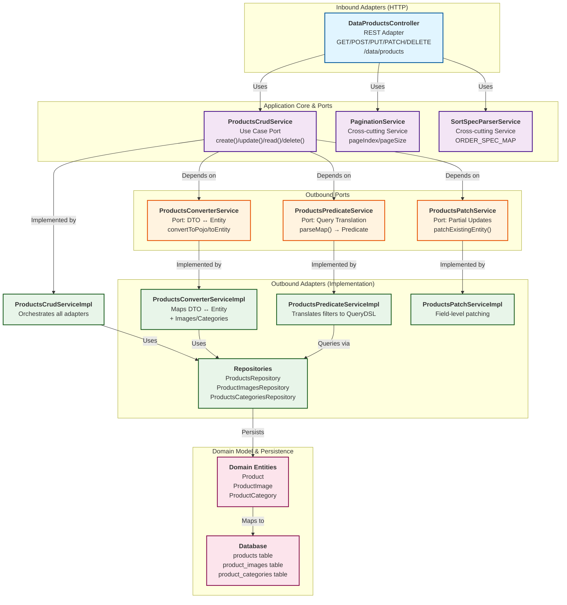

# Products Domain — Hexagonal Architecture

## Architecture Diagram



---

## Component Breakdown

### **Inbound Adapters (Left Side)**
| Component | Role | Location |
|-----------|------|----------|
| **DataProductsController** | REST HTTP adapter; routes requests to application core | [src/main/java/org/trebol/api/controllers/DataProductsController.java](../../../src/main/java/org/trebol/api/controllers/DataProductsController.java) |

### **Application Core**
| Component | Role | Location |
|-----------|------|----------|
| **ProductsCrudService** (Port) | Defines use-case contract: CRUD operations | [src/main/java/org/trebol/jpa/services/crud/ProductsCrudService.java](../../../src/main/java/org/trebol/jpa/services/crud/ProductsCrudService.java) |
| **PaginationService** | Cross-cutting: pageIndex, pageSize logic | [src/main/java/org/trebol/api/services/PaginationService.java](../../../src/main/java/org/trebol/api/services/PaginationService.java) |
| **SortSpecParserService** | Cross-cutting: parse sort order from params | [src/main/java/org/trebol/jpa/services/SortSpecParserService.java](../../../src/main/java/org/trebol/jpa/services/SortSpecParserService.java) |

### **Outbound Ports (Top Right)**
| Port | Purpose | Location |
|------|---------|----------|
| **ProductsPredicateService** | Port: translate query filters → QueryDSL predicates | [src/main/java/org/trebol/jpa/services/predicates/ProductsPredicateService.java](../../../src/main/java/org/trebol/jpa/services/predicates/ProductsPredicateService.java) |
| **ProductsConverterService** | Port: map DTO ↔ Entity + image conversion | [src/main/java/org/trebol/jpa/services/conversion/ProductsConverterService.java](../../../src/main/java/org/trebol/jpa/services/conversion/ProductsConverterService.java) |
| **ProductsPatchService** | Port: apply partial field updates to entity | [src/main/java/org/trebol/jpa/services/patch/ProductsPatchService.java](../../../src/main/java/org/trebol/jpa/services/patch/ProductsPatchService.java) |

### **Outbound Adapters (Bottom Right)**
| Adapter | Implementation | Location |
|---------|----------------|----------|
| **ProductsCrudServiceImpl** | Orchestrates converters, patch, repositories; implements CRUD logic | [src/main/java/org/trebol/jpa/services/crud/impl/ProductsCrudServiceImpl.java](../../../src/main/java/org/trebol/jpa/services/crud/impl/ProductsCrudServiceImpl.java) |
| **ProductsPredicateServiceImpl** | Implements predicate building (id, barcode, name, category filters) | [src/main/java/org/trebol/jpa/services/predicates/impl/ProductsPredicateServiceImpl.java](../../../src/main/java/org/trebol/jpa/services/predicates/impl/ProductsPredicateServiceImpl.java) |
| **ProductsConverterServiceImpl** | Implements DTO ↔ Entity mapping, image conversion | [src/main/java/org/trebol/jpa/services/conversion/impl/ProductsConverterServiceImpl.java](../../../src/main/java/org/trebol/jpa/services/conversion/impl/ProductsConverterServiceImpl.java) |
| **ProductsPatchServiceImpl** | Implements field-level patching (barcode, name, price, etc.) | [src/main/java/org/trebol/jpa/services/patch/impl/ProductsPatchServiceImpl.java](../../../src/main/java/org/trebol/jpa/services/patch/impl/ProductsPatchServiceImpl.java) |
| **Repositories** | Spring Data JPA adapters to database | [src/main/java/org/trebol/jpa/repositories](../../../src/main/java/org/trebol/jpa/repositories) |

### **Domain Model**
| Entity | Description |
|--------|-------------|
| **Product** | Core domain entity: name, barcode, price, stock, description, category |
| **ProductImage** | Relationship between Product and Image (links product to images) |
| **ProductCategory** | Category reference (code-based lookup) |

---

## Request Flow Examples

### **1. Create Product**
```
HTTP POST /data/products { ProductPojo }
  ↓
DataProductsController.create()
  ↓
ProductsCrudService.create(ProductPojo input)
  ├─ ProductsConverterService.convertToNewEntity(input) → Product
  ├─ ProductsRepository.saveAndFlush(product) → Product (persisted)
  ├─ ProductImagesRepository.saveAll(productImages) → [ProductImage] (link images)
  └─ ProductsConverterService.convertToPojo(product) → ProductPojo
  ↓
HTTP 201 CREATED
```

### **2. Read Products with Filters & Pagination**
```
HTTP GET /data/products?barcodeLike=ABC&pageIndex=0&pageSize=10&sortBy=name
  ↓
DataProductsController.readMany(Map<String,String> params)
  ├─ PaginationService.determineRequestedPageIndex(params) → 0
  ├─ PaginationService.determineRequestedPageSize(params) → 10 (capped)
  ├─ SortSpecParserService.parse(ORDER_SPEC_MAP, params) → Sort order
  ├─ ProductsPredicateService.parseMap(params) → Predicate (barcodeLike)
  ├─ ProductsRepository.findAll(predicate, pageable) → Page<Product>
  ├─ Convert each Product → ProductPojo via ProductsConverterService
  └─ Return DataPagePojo<ProductPojo>
  ↓
HTTP 200 OK { DataPagePojo<ProductPojo> }
```

### **3. Partial Update Product**
```
HTTP PATCH /data/products { Map<String,Object> changes } ?id=123
  ↓
DataProductsController.partialUpdate(changes, Map<String,String> params)
  ├─ Validate params not empty
  ├─ ProductsPredicateService.parseMap(params) → Predicate (id=123)
  ├─ ProductsCrudService.partialUpdate(changes, predicate)
  │  ├─ ProductsRepository.findOne(predicate) → Product
  │  ├─ ProductsPatchService.patchExistingEntity(changes, product) → patched Product
  │  └─ ProductsRepository.saveAndFlush(patchedProduct) → Product (persisted)
  └─ ProductsConverterService.convertToPojo(product) → ProductPojo
  ↓
HTTP 204 NO_CONTENT
```

### **4. Delete Products**
```
HTTP DELETE /data/products ?barcode=XYZ123
  ↓
DataProductsController.delete(Map<String,String> params)
  ├─ Validate params not empty
  ├─ ProductsPredicateService.parseMap(params) → Predicate (barcode=XYZ123)
  ├─ ProductsCrudService.delete(predicate)
  │  └─ ProductsRepository.delete(predicate)
  ↓
HTTP 204 NO_CONTENT
```

---

## Hexagonal Benefits in This Design

1. **Inversion of Control**: Core use-case (`ProductsCrudService`) depends on abstractions (ports), not implementations.
2. **Testability**: Ports allow mocking of predicate, converter, patch services in unit tests.
3. **Flexibility**: Replace predicate/converter/patch implementations without changing core logic.
4. **Separation of Concerns**:
   - Controller = HTTP protocol handling
   - CRUD service = orchestration & validation
   - Predicates = filter logic
   - Converters = DTO/Entity mapping
   - Repositories = persistence
5. **Domain-Centric**: Domain entities (Product, ProductImage) are independent of adapters.

---

## Key Takeaways

- **Ports** = interfaces that define contracts (PredicateService, ConverterService, PatchService, CrudService)
- **Adapters** = implementations that fulfill contracts (PredicateServiceImpl, ConverterServiceImpl, etc.) + repositories
- **Controller** = inbound adapter (HTTP)
- **Repositories** = outbound adapters (database)
- **Core** = use cases + domain logic (orchestration in ProductsCrudServiceImpl)
- **Entities** = domain model (Product, ProductImage, ProductCategory)

This structure allows you to **replace any adapter** (e.g., switch from JPA to a different ORM, or controller to gRPC) without affecting the domain or other adapters.
