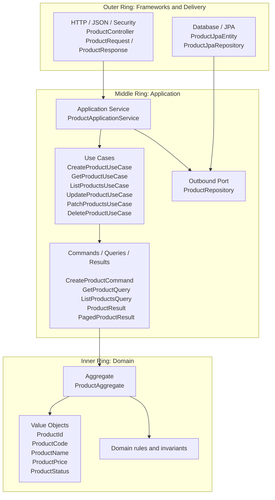

# Background: Clean and Hexagonal Architecture

This note explains the architectural model used by the Product module refactor and why the code was reorganized around Clean Architecture and Hexagonal Architecture principles.

## 1) Layer and ring model

The core idea is that business rules should sit in the center, while frameworks, databases, and HTTP details remain outside. Dependencies point inward: outer layers may depend on inner layers, but inner layers never depend on outer layers.

A simpler reading of the same structure is:

- the controller belongs to the outer edge and only translates HTTP into use-case input;
- the application service coordinates a use case and never speaks JPA directly;
- the domain owns the product aggregate and its invariants;
- persistence is a replaceable detail behind a port.

## 2) Target package structure by layer

The current Product module already follows the intended separation closely. The packages can be understood by responsibility rather than by framework type.

### Domain
The domain layer contains the core model and rules.

- `src/main/java/org/trebol/product/domain/aggregate/ProductAggregate.java`
- `src/main/java/org/trebol/product/domain/vo/ProductId.java`
- `src/main/java/org/trebol/product/domain/vo/ProductCode.java`
- `src/main/java/org/trebol/product/domain/vo/ProductName.java`
- `src/main/java/org/trebol/product/domain/vo/ProductPrice.java`
- `src/main/java/org/trebol/product/domain/vo/ProductStatus.java`
- `src/main/java/org/trebol/product/domain/port/ProductRepository.java`
- `src/main/java/org/trebol/product/domain/exception/*`

This is the most important rule: the domain layer must remain free of Spring, web annotations, JPA annotations, and database-specific APIs.

### Application
The application layer expresses use cases and orchestrates the domain.

- `src/main/java/org/trebol/product/application/usecase/*`
- `src/main/java/org/trebol/product/application/command/*`
- `src/main/java/org/trebol/product/application/query/*`
- `src/main/java/org/trebol/product/application/result/*`
- `src/main/java/org/trebol/product/application/service/ProductApplicationService.java`
- `src/main/java/org/trebol/product/application/service/ProductApplicationMapper.java`

This layer defines what the system does: create, update, read, list, patch, and delete products. It should coordinate work, not implement persistence or HTTP behavior.

### Inbound adapters
Inbound adapters expose the application through delivery mechanisms such as REST.

- `src/main/java/org/trebol/product/adapter/inbound/web/ProductController.java`
- `src/main/java/org/trebol/product/adapter/inbound/web/ProductWebMapper.java`
- `src/main/java/org/trebol/product/adapter/inbound/dto/*`

These classes translate HTTP requests into application commands or queries and translate application results back into HTTP responses.

### Outbound adapters
Outbound adapters implement the ports declared by the core.

- `src/main/java/org/trebol/product/adapter/outbound/persistence/ProductRepositoryAdapter.java`
- `src/main/java/org/trebol/product/adapter/outbound/persistence/ProductJpaEntity.java`
- `src/main/java/org/trebol/product/adapter/outbound/persistence/ProductJpaRepository.java`
- `src/main/java/org/trebol/product/adapter/outbound/persistence/ProductPersistenceMapper.java`

These classes own JPA, SQL, and persistence mapping details. They are replaceable as long as they continue to satisfy the repository port contract.

### Infrastructure
Infrastructure contains framework wiring and cross-cutting configuration.

- `src/main/java/org/trebol/product/config/*`
- `src/main/java/org/trebol/product/security/*`
- Spring Boot configuration classes and bean setup
- transaction and environment configuration

Infrastructure is allowed to know about frameworks, but the domain should not depend on it.

## 3) Port and adapter boundary decisions

The key design choice is that the core depends on abstractions, not implementations.

### Why `ProductRepository` is a port
The repository interface is placed inside the domain package because the domain and application layers need to describe persistence needs without committing to JPA.

That gives three benefits:

- the application service can be unit tested with simple mocks;
- the persistence strategy can change without rewriting business logic;
- the domain remains stable even if the database changes.

### Why `ProductRepositoryAdapter` is an adapter
The adapter is the place where database details live. It can use JPA entities, Spring Data repositories, criteria queries, or specifications, but only behind the port.

That boundary is important because:

- `ProductJpaEntity` is a persistence shape, not a business shape;
- `ProductAggregate` is the business shape, not a table shape;
- the adapter is responsible for mapping between those worlds.

### Why commands, queries, and results exist
The application layer uses explicit request and response objects because they make intent visible.

- `GetProductQuery` says the operation is read-only and identifies a product by id.
- `ListProductsQuery` says the operation is a paged search with filters.
- `CreateProductCommand`, `UpdateProductCommand`, and `BulkPatchProductCommand` say the operation changes state.
- `ProductResult` and `PagedProductResult` prevent controller code from depending on domain internals.

This is cleaner than passing raw HTTP DTOs deeper into the system.

### Why web DTOs stay outside the core
`ProductRequest`, `ProductResponse`, `PagedProductResponse`, and `BulkPatchProductResponse` are HTTP-facing shapes. They exist to match the API contract, not to represent the domain.

Keeping them in the adapter layer avoids two common problems:

- HTTP field names leaking into the domain model;
- domain changes forcing API changes when they do not need to.

## 4) What remains unchanged externally

The architecture changed internally, but the public API contract remains the same unless a deliberate versioned change is introduced.

What stays stable:

- the base route remains `/product-module`;
- `GET /product-module/{id}` still returns one product or `404` if not found;
- `GET /product-module` still returns a paged list response;
- `POST`, `PUT`, `PATCH`, and `DELETE` remain resource-based HTTP operations;
- query parameters and JSON bodies remain the external integration contract;
- response JSON continues to be produced by the web adapter, not by the domain layer.

This is the main migration principle: rewrite the inside, preserve the outside.

### External contract intent
The client should see the same kind of behavior even if the internals are now cleaner.

- The request URL does not reveal whether the implementation uses JPA, Specification, or another storage mechanism.
- The response bodies are still shaped for API consumers, not for domain objects.
- Security rules and status codes remain part of the contract.

That stability lets the team refactor safely while existing clients continue to work.

## 5) Why this model fits the Product module

The Product domain is a good fit for Clean and Hexagonal Architecture because it has a clear business core and several replaceable concerns around it.

- product rules belong in the aggregate and value objects;
- HTTP should only translate input/output;
- persistence should be swappable;
- read paths, write paths, and bulk patch paths should each be explicit use cases;
- tests become simpler because the core can be exercised without the web layer or the database.

In practice, this structure makes the module easier to extend. Adding a new endpoint should usually mean adding a new use case and a thin adapter, not pushing more logic into controllers or repositories.

## 6) Summary

Clean Architecture and Hexagonal Architecture both aim for the same result: stable business rules surrounded by replaceable technical details. In this codebase, that means the controller, mapper, and repository adapter are outside the core; the application service coordinates use cases; and the domain aggregate and value objects remain the authoritative source of product behavior.

The external API contract stays intact. The internal shape changes so the system becomes easier to test, easier to reason about, and easier to evolve.
