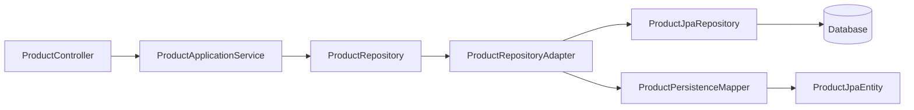
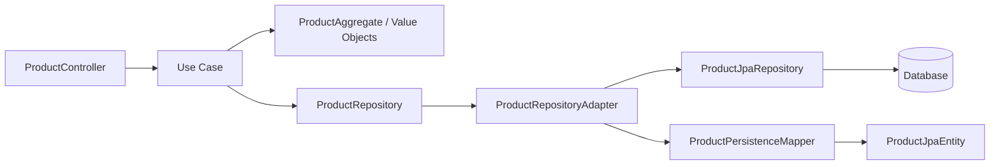

# Product Domain Dependency Graphs

This note captures the current dependency direction in the product module and the intended clean-architecture target.

## Before

Current shape:

- The web layer depends on the application service.
- The application service is the main orchestration point.
- The repository port is implemented by a JPA-backed adapter.
- Persistence mapping and JPA entities sit outside the core.

## After

Target shape:

- The controller only translates HTTP input to a use case call.
- Use cases own the business flow.
- The domain stays independent of web and persistence concerns.
- The repository port remains the boundary to infrastructure.

## Difference

- Before: the module is organized around a service layer that still sits close to framework concerns.
- After: the module is organized around use cases and a pure domain core, with adapters pushed to the edges.
- Both graphs keep the repository adapter on the outside, but the target graph makes the inward dependency direction explicit.